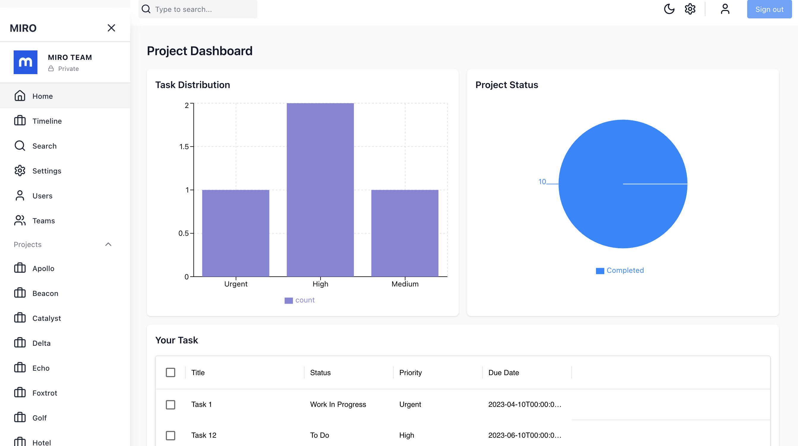
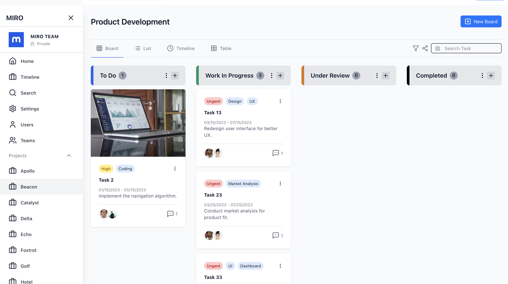
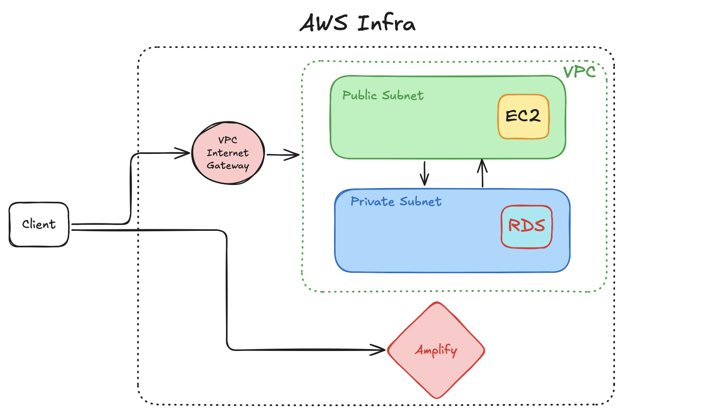

## Miiro
Miiro is a project management website built via NextJS for the front-end, and Node/Express + AWS (S3, EC2, Amplify) for the backend & hosting.  

[Unfortunately, I've run out of credits so I cannot continue running on AWS :( ] However, please take a look at the outline below for the AWS solution!  
This requires setting up the AWS instances, linking the respective API keys to Amplify and in the server-side code.  

Alternative URL: https://master.d8r9ejwumrhj3.amplifyapp.com

